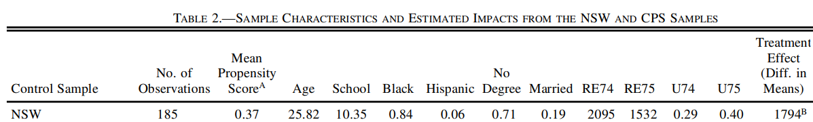
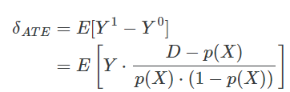

```{r setup, include=FALSE}
knitr::opts_chunk$set(echo = TRUE)

```

# Modelación en Ciencia de Datos
## *Matching*

Para la elaboración de la práctica se utilizan las siguientes librerías: 

```{r, message=FALSE}
library(tidyverse)
library(haven)
library(MatchIt)
library(knitr)
```

Para el ejercicio se utilizan los datos del experimento del mercado laboral del *National Supported Work*. El programa consistía en proveer experiencia laboral aquellos individuos que habían efrentado problemas económicos y sociales previos a su registro en el programa. Los participantes del experiemento fueron separados en un grupo de tratamiento y uno de control. 

Por otro lado, se utilizan controles experiementales para obtener una estimación benchmark para el impacto del tratamiento uniendo a las unidades de tratamiento del experimento con la unidades de comparación de la *Population Survey of Income Dynamics (PSID)* y del *Current Population Survey (CPS)*.

Se cargan los datos que su utilizarán en la práctica y se contruye el set de datos utilizado en el paper agregando las variables necesarias para ajustar el modelo. 

```{r}
cps <- read_dta("https://raw.github.com/scunning1975/mixtape/master/cps_mixtape.dta") 
psid <- read_dta("https://raw.github.com/scunning1975/mixtape/master/nsw_mixtape.dta")

nsw_dw_cpscontrol <- cps %>% 
  bind_rows(psid) %>% 
  mutate(agesq = age^2,
         agecube = age^3,
         educsq = educ^2,
         u74 = ifelse(re74 == 0,0,1),
         u75 = ifelse(re75 == 0,0,1),
         interaction1 = educ*re74
         )
```


### 1. Revise la descripción del programa que se realiza en la Sección I y replique la Tabla 1 de la muestra utilizada por los autores para describir a su conjunto de datos.

```{r}
tabla1 <- nsw_dw_cpscontrol %>% 
  filter(data_id == "Dehejia-Wahba Sample") %>% 
  select(-matches('sq|cube|interaction')) %>% 
  group_by(treat = factor(treat, levels = c(1,0))) %>% 
  summarise(across(where(is.numeric), mean),
            sample_size = n()) %>% 
   pivot_longer(names_to = 'variable', values_to = 'values', cols = -treat) %>% 
   pivot_wider(names_from = treat, values_from = values) %>% 
  select(variable, 'Tratamiento' = 2, 'Control' = 3)

```


```{r, echo=FALSE}
kable(tabla1, digits = 2)
```

En la tabla 1 se muestra la media de todas la características de la muestra de datos utilizada para el análisis. Existen diferencias entre la tabla del paper y la tabla obtenida con estos datos únicamente en la variable `re75`: *Real earnings 12 months before training*.
Vale la pena mencionar que en el paper cuentan con la variable de núm de hijos, mientras que en los datos provistos no está disponible.

En cuanto la comparación entre grupos (Treatment vs Control), las diferencias más importantes se aprecian en `no degree`: *Proportion of school dropouts*, `hisp`: *Proportion of Hispanics*, `marr`: *Married*.

### 2. Calcule el ATE del experimento.   

Se obtiene que el efecto del NSW job-training program sobre los ingresos reales fue un incremento de $1,794.343, calculado como la diferencia de los promedios del ingreso real en 1978 (año de comparación) (renglón 1 de la tabla 2).

```{r}
ATE<-tabla1 %>% 
  filter(variable == 're78') %>% 
  summarise(ATE = Tratamiento - Control)
```


```{r, echo = FALSE}
kable(ATE, digits = 2)
```

Lo cual coincide con el renglón 1 de la tabla 2:

```{r, echo = FALSE}

```


### 3. Siguiendo el procedimiento de los autores, ahora utilice la información de la encuesta CPS como grupo de control no experimental. Agregue este conjunto de datos a los datos experimentales y estime el propensity score usando un modelo logit.

Los datos del CPS se agregaron desde el inicio, para evitar repetir el proceso de creación de variables. Sin embargo, es importante notar que es necesario eliminar los datos del PSID, es decir, los datos en donde `treat == 0` provenientes del dataset *Dehejia-Wahba Sample*  

```{r}
dta_mod <- nsw_dw_cpscontrol %>% 
  filter(!(data_id == 'Dehejia-Wahba Sample' & treat == 0))
```

Definimos la fórmula con las variables:
$$Age, Age^2, Age^3, School, School^2 , Married, No degree, Black, Hisp, RE74, RE75, U74, U75, School*RE74$$
Al igual que se realizó en el paper.

```{r, message=FALSE}
psid_cov <- dta_mod %>% 
  select(age:re75, agesq:interaction1) %>% 
  names() 

frml <- paste0(psid_cov, collapse = '+') %>% 
  paste('treat', ., sep = '~') %>% 
  as.formula()

frml
```

Se define el modelo:

```{r}
logit_cps <- glm(frml, family = binomial(link = 'logit'),
            data = dta_mod)
  
```
Se calcula el *propensity score* como las predicciones del modelo sobre el conjunto de datos con el que se ajustó: 

```{r}

pr_df <- dta_mod %>% 
  mutate(pr_score = logit_cps$fitted.values)

```

```{r, echo = FALSE}
pr_df
```


### 4. Mediante la construcción del histograma para ambos grupos, analice la región del *common support*.

```{r, warning=FALSE}
pr_df %>% 
  mutate(treat = ifelse(treat==0, 'Control', 'Treatment')) %>% 
  ggplot(aes(pr_score, after_stat(density))) +
  geom_histogram(binwidth = 0.02)+ #el valor del eje y cambia de acuerdo al valor de binwidth
  facet_wrap(~treat)+
  xlim(c(-0.1,1.02)) + xlab("Propensity Score")+
  theme_bw()
```

Los *propensity scores* o *p-scores* de las observaciones del grupo de control se distribuyen de manera relativamente uniforme a lo largo del intervalo $[0,.95]$. En contraste con el grupo de control, en el cual la gran mayoría de los *p-scores* se concentran en $[0,0.01]$.

Esto quiere decir que hay muy pocas observaciones que compartan *p-scores* entre ambos grupos.

En el paper, descartan todas las observaciones del grupo de control cuyo *p-score* es menor que el valor mínimo de *p-scores* del grupo de control.

De esta manera, se excluye la gran mayoría de las observaciones que se concentraban en la primer barra del histograma:

```{r}
(min_treated <- pr_df %>% 
  filter(treat == 1) %>% 
  summarise(min = min(pr_score)) %>% 
  pull(min))
```


```{r}
pr_df %>% 
  mutate(treat = ifelse(treat==0, 'Control', 'Treatment')) %>% 
  filter(pr_score >= min_treated) %>% ##excluimos 12136 con este filtro
  ggplot(aes(pr_score, after_stat(density), fill = treat, group = treat))+
  geom_histogram(position = "dodge",bins = 19, alpha = 0.95)+
  theme_bw()

```

Incluso con el filtro aplicado, se observa que aún hay muy pocas observaciones del grupo de control que tengan un *p-score* de 0.01 o más.

###  5. Utilice el procedimiento de matching bajo los siguientes criterios para calcular el ATE, compare sus resultados y concluya el efecto del tratamiento en el contexto del problema.

Datos:

```{r}
new_dta <-nsw_dw_cpscontrol %>% 
  filter(!(data_id == 'Dehejia-Wahba Sample' & treat == 0)) 
```

#### a)  Weighting on the propensity score


Partimos de que:

```{r, echo = FALSE}

```

La prueba de esta igualdad:

```{r, echo = FALSE}

```

De esta manera, entonces, el estimador del ATE utilizando estimadores muestrales es:

```{r, echo = FALSE}

```

Donde:

* $$ N = $$ `tamaño de muestra`

* $$ D =$$ `treat`

* $$ Y = $$ `re78`

* $$ \hat{p}(X_i) = $$ `propensity score`

De esta manera, calculamos el ATE con nuestra muestra:

```{r}
ATE_wt <- pr_df %>% 
  select(treat, pr_score, re78) %>% 
  mutate(ate_i = re78*(treat - pr_score)/(pr_score * (1-pr_score))) %>% 
  summarise(ATE = sum(ate_i)/nrow(.))
```

```{r, echo = FALSE}
kable(ATE_wt, digits = 2)
```

Tenemos que -11876.79 está muy alejado del 1794 que fue reportado en el paper. Esto se debe a que, al estar utilizando el inverso de las probabilidades, cuando `p-score` es muy cercano a $0$ o a $1$, el valor del ponderador crece excesivamente, haciendo que la suma final se haga con valores extremos, desestabilizando el cálculo en general.

Una manera de lidiar este problema es *recortando* los valores más extremos, es decir, conservando los valores del *p-score* que se encuentren en el intervalo $[0.1,0.9]$ 

De esta manera, lo calculamos como:
```{r}
ATE_wt <- pr_df %>% 
  select(treat, pr_score, re78) %>% 
  filter(between(pr_score, 0.1,0.9)) %>% 
  mutate(ate_i = re78*(treat - pr_score)/(pr_score * (1-pr_score))) %>% 
  summarise(ATE = sum(ate_i)/nrow(.))
```

```{r, echo = FALSE}
kable(ATE_wt, digits = 2)
```

Lo cual nos da un valor mucho más cercano al 1794 reportado anteriormente.

#### b) Nearest-neighbor matching

Este método esta precargado en la librería `matchit`.

```{r}
mod_match_nn <- matchit(frml, method = 'nearest', data = new_dta,
                        distance = 'glm', link = 'logit')

dta_matched_nn <- match.data(mod_match_nn)

N_ATE<- dta_matched_nn %>% 
  group_by(treat = factor(treat, levels = c(1,0))) %>% 
  summarise(across(where(is.numeric), mean),
            sample_size = n()) %>% 
  select(treat, re78) %>% 
  summarise(ATE = re78 -lead(re78)) %>% 
  drop_na()
```

```{r, echo = FALSE}
kable(N_ATE)
```

Con el método del vecino más cercano, tenemos un ATE bastante cercano al valor reportado en el paper.

#### c) Coarsened exact matching

Este método esta precargado en la librería `matchit`.

```{r}
mod_match_cem <- matchit(frml, method = 'cem', data = new_dta,
                         distance = 'glm', link = 'logit', estimand = 'ATE')

dta_matched_cem <- match.data(mod_match_cem, distance = 'pr_score')

CEM_ATE<- dta_matched_cem %>% 
  group_by(treat = factor(treat, levels = c(1,0))) %>% 
  summarise(across(where(is.numeric), mean),
            sample_size = n()) %>% 
  select(treat, re78) %>% 
  summarise(ATE = re78 -lead(re78)) %>% 
  drop_na()
```


```{r, echo = FALSE}
kable(CEM_ATE)
```

El método de Coarsened Exact Matching estima un resultado mayor al valor real. 


## Bibliografía

- [Causal Inference: The mixtape](https://mixtape.scunning.com/)
- Rajeev H. Dehejia, Sadek Wahba; Propensity Score-Matching Methods for Nonexperimental Causal Studies. The Review of Economics and Statistics 2002; 84 (1): 151–161. doi: https://doi.org/10.1162/003465302317331982


